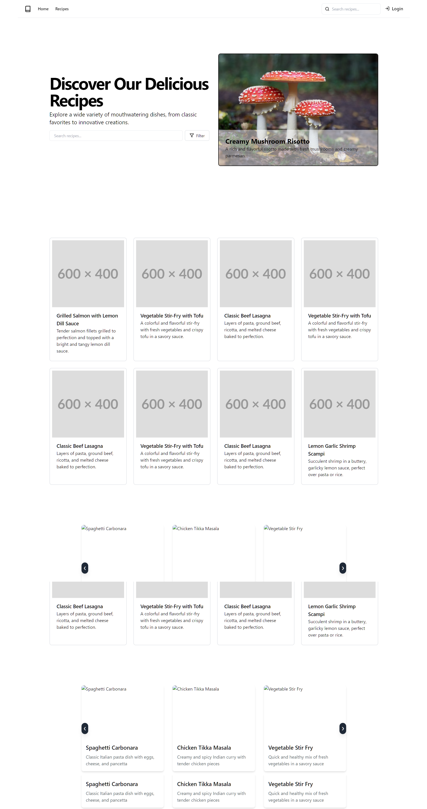

# Recipe Sharing App

## Overview
This Recipe Sharing App is a platform where food enthusiasts can share, discover, and interact with recipes from around the world. Users can create accounts, post their own recipes, browse recipes shared by others, save their favorites, and engage with the community through comments and ratings.

## Features
- User Authentication: Sign up, log in, and manage user profiles
- Recipe Management: Create, edit, and delete recipes
- Recipe Discovery: Browse and search for recipes by category, ingredients, or user
- Favorites: Save favorite recipes for quick access
- Social Interaction: Comment on recipes and rate them
- Responsive Design: Fully functional on both desktop and mobile devices

## Technologies Used
- Frontend: React.js, Redux for state management
- Backend: Node.js with Express.js
- Database: MongoDB
- Authentication: JWT (JSON Web Tokens)
- Image Upload: Cloudinary
- Styling: CSS with potential use of a UI framework (e.g., Material-UI or Bootstrap)




## Backend Integration

To merge the backend with the frontend:

1. Update API Endpoints:
   - Modify the frontend API calls to use the new backend endpoints.
   - Ensure all routes in `Frontend/src/api/` or similar files point to the correct backend URLs.

2. Environment Configuration:
   - Create a `.env` file in the frontend root directory.
   - Add `REACT_APP_API_URL=http://localhost:4000/api` (adjust if your backend port differs).

3. Authentication:
   - Update the authentication flow to use JWT tokens from the backend.
   - Implement token storage and refresh mechanisms.

4. Data Models:
   - Align frontend data structures with backend models (User, Recipe, Category, etc.).

5. Error Handling:
   - Implement consistent error handling for backend responses.

6. CORS Configuration:
   - Ensure the backend allows requests from the frontend origin.

7. File Uploads:
   - Update image upload logic to work with the Cloudinary integration.

8. Testing:
   - Perform thorough testing of all features to ensure proper frontend-backend communication.

9. Deployment:
   - Set up a production environment for both frontend and backend.
   - Configure environment variables for production use.

Remember to keep sensitive information (like API keys) in environment variables and not in the source code.


## Redux Setup and User Profile Management

To set up Redux and manage the user profile after login:

1. Install Redux dependencies:
   ```
   npm install redux react-redux @reduxjs/toolkit
   ```

2. Create a Redux store:
   - Create a file `src/store/index.js`:
     ```javascript
     import { configureStore } from '@reduxjs/toolkit';
     import userReducer from './userSlice';

     export const store = configureStore({
       reducer: {
         user: userReducer,
       },
     });
     ```

3. Create a user slice:
   - Create a file `src/store/userSlice.js`:
     ```javascript
     import { createSlice } from '@reduxjs/toolkit';

     const userSlice = createSlice({
       name: 'user',
       initialState: {
         currentUser: null,
         isAuthenticated: false,
       },
       reducers: {
         setUser: (state, action) => {
           state.currentUser = action.payload;
           state.isAuthenticated = true;
         },
         clearUser: (state) => {
           state.currentUser = null;
           state.isAuthenticated = false;
         },
       },
     });

     export const { setUser, clearUser } = userSlice.actions;
     export default userSlice.reducer;
     ```

4. Wrap your app with Redux Provider:
   - In `src/index.js`:
     ```javascript
     import { Provider } from 'react-redux';
     import { store } from './store';

     ReactDOM.render(
       <Provider store={store}>
         <App />
       </Provider>,
       document.getElementById('root')
     );
     ```

5. Update login logic:
   - In your login component (e.g., `EnhancedLoginToggle.jsx`):
     ```javascript
     import { useDispatch } from 'react-redux';
     import { setUser } from '../store/userSlice';

     // Inside your component:
     const dispatch = useDispatch();

     const handleLogin = async (e) => {
       e.preventDefault();
       try {
         const response = await axios.post('/api/auth/login', { email, password });
         if (response.data.success) {
           dispatch(setUser(response.data.user));
           navigate('/profile');
         } else {
           setResponse(response.data.message || 'Login failed. Please try again.');
         }
       } catch (error) {
         console.error('Login error:', error);
         setResponse(error.response?.data?.message || 'An error occurred during login.');
       }
     };
     ```

6. Create a Profile component:
   - Create a new file `src/components/Profile.jsx`:
     ```javascript
     import React from 'react';
     import { useSelector } from 'react-redux';

     const Profile = () => {
       const user = useSelector((state) => state.user.currentUser);

       if (!user) {
         return <div>Loading...</div>;
       }

       return (
         <div>
           <h1>Welcome, {user.userName}!</h1>
           
           <p>Email: {user.email}</p>
           <p>Location: {user.location}</p>
           <p>Account Type: {user.accountType}</p>
           {user.bio && <p>Bio: {user.bio}</p>}
           {user.contactNumber && <p>Contact: {user.contactNumber}</p>}
         </div>
       );
     };

     export default Profile;
     ```

7. Add a route for the Profile component:
   - In your routing setup (e.g., `App.js`):
     ```javascript
     import Profile from './components/Profile';

     // Inside your Routes:
     <Route path="/profile" element={<Profile />} />
     ```

8. Implement logout functionality:
   - Create a logout function that dispatches the clearUser action and redirects to the login page.

9. Protect routes:
   - Create a PrivateRoute component to wrap protected routes and check if the user is authenticated.

Remember to handle token storage and include the token in your API requests after login. You may want to use localStorage or a more secure method like httpOnly cookies for token storage.

